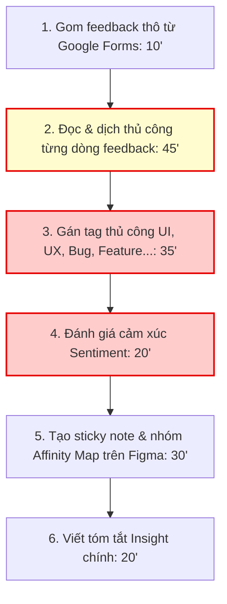
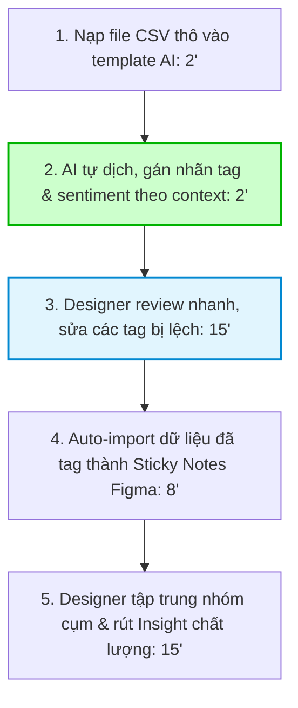
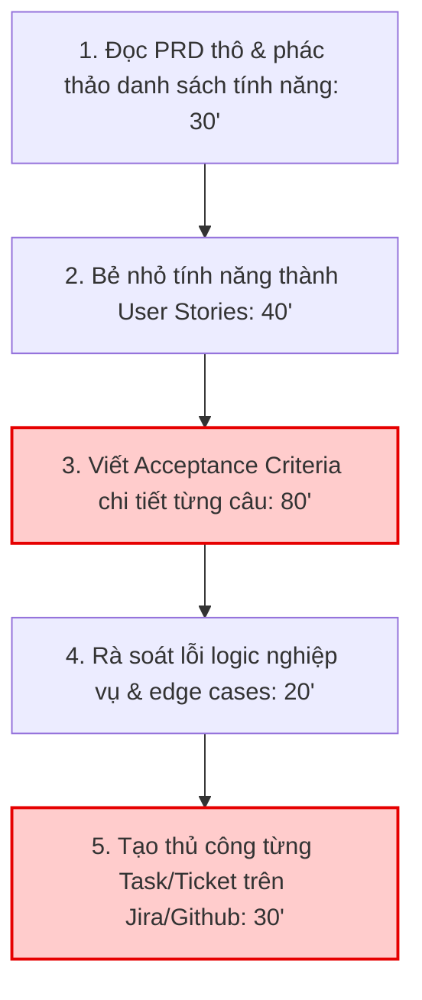
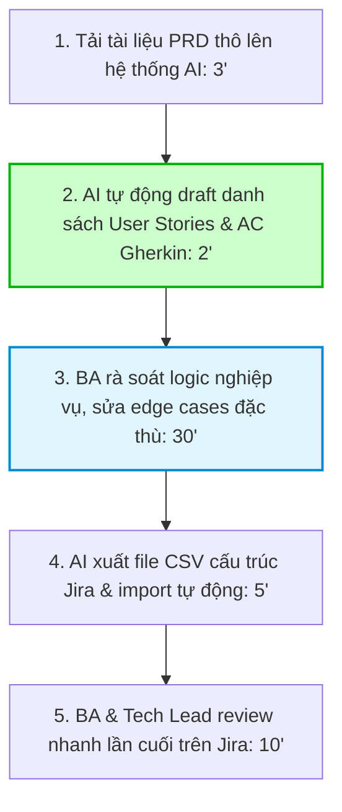
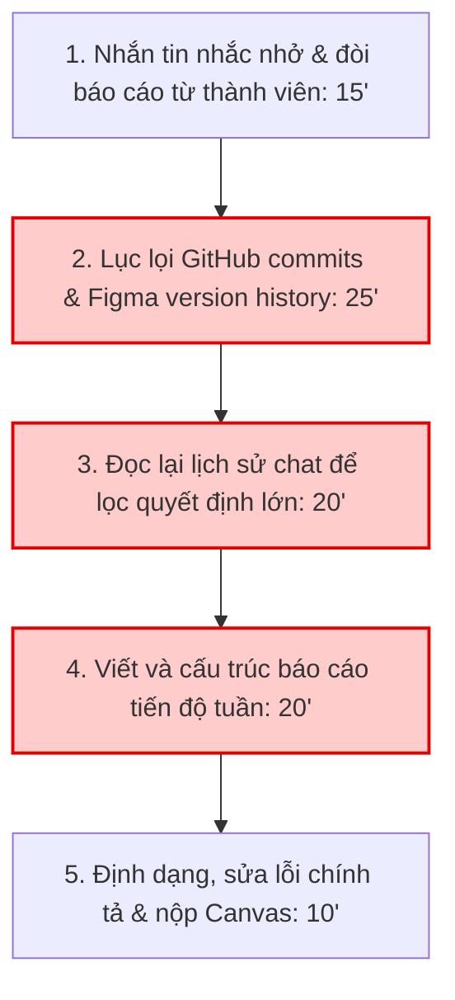
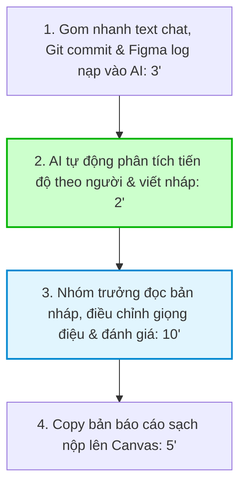

# Phase 1 — Individual Problem Scan & Top 3 Problem Cards

> **Học viên:** Nguyễn Thanh Toàn
> **Mã học viên:** 2A202600633
> **Bối cảnh:** Sinh viên ngành Công nghệ / Thiết kế sản phẩm tại VinUni, thường xuyên làm bài tập lớn thiết kế sản phẩm, BA, Data Analytics và làm việc nhóm dưới áp lực deadline của các kỳ học.

---

## 1. Ngân Hàng Quét Vấn Đề Rộng (Broad Scan - 6 Problems)

Dưới đây là danh sách 6 vấn đề thực tế được quét qua 4 lăng kính cốt lõi: **Lặp lại**, **Tốn thời gian**, **AI có thể làm tốt hơn**, và **Pain từ người khác**.

| # | Lăng kính | Problem quan sát được | Ai đang đau? | Dấu hiệu thật (Evidence & Metrics) |
|---|---|---|---|---|
| **1** | **Tốn thời gian** & **AI tốt hơn** | Phân loại và tổng hợp hàng trăm phản hồi thô (User Feedback) từ khảo sát người dùng cho bài tập lớn môn UX/Product Design. | Student Product Designer / BA trong bài tập lớn thiết kế sản phẩm. | Khảo sát thu về **100+ phản hồi thô** trên Google Forms/Sheets. Designer phải đọc từng câu, phân loại nhãn (UI, UX, Feature, Bug) và cảm xúc (Sentiment). Mất **~160 phút/dự án**. Phân tích dễ bị cảm tính, bỏ sót ý hoặc quá tải. |
| **2** | **Tốn thời gian** & **Lặp lại** | Chuyển đổi tài liệu PRD thô hoặc ghi chú brainstorm của nhóm thành danh sách User Stories chi tiết kèm tiêu chuẩn nghiệm thu (Acceptance Criteria - Gherkin Given-When-Then). | Student Business Analyst (BA) hoặc Scrum Master của nhóm dự án. | Mỗi tính năng lớn cần bẻ thành **10-15 User Stories**. BA phải viết thủ công AC theo đúng cú pháp Gherkin. Mất **~200 phút/sprint**. Quy trình lặp đi lặp lại rất mệt mỏi, dễ sót các trường hợp biên (edge cases). |
| **3** | **Lặp lại** & **Pain từ người khác** | Nhóm trưởng phải tổng hợp thông tin rời rạc từ các kênh chat, Figma commits, GitHub commits để viết Nhật ký tiến độ tuần (Weekly Project Log/Recap) gửi giảng viên. | Nhóm trưởng (Team Lead) bài tập lớn công nghệ/sản phẩm tại VinUni. | Mỗi Chủ nhật, nhóm trưởng mất **~90 phút** để nhắn tin đòi update, lội log Discord/Slack, xem Figma history và GitHub để gom dữ liệu viết báo cáo. Thành viên thường báo cáo sơ sài hoặc trễ hạn, gây mệt mỏi cho nhóm trưởng. |
| **4** | **AI tốt hơn** & **Pain từ người khác** | Tìm kiếm quy chế học vụ, quy định hành chính và biểu mẫu biểu mẫu của trường (đổi môn, xin bảng điểm, nghỉ phép) khi cần làm thủ tục. | Sinh viên VinUni, đặc biệt là sinh viên năm nhất hoặc sinh viên bận rộn. | Mất **20-30 phút/lần** lục lọi web trường, Canvas, hoặc tìm email thông báo cũ. Nhiều bài post hỏi đi hỏi lại cùng câu hỏi hành chính trên group Discord/Facebook của khóa học; phòng đào tạo quá tải vì mail trả lời lặp lại. |
| **5** | **Tốn thời gian** | Tổng hợp bài giảng, ghi chú và tài liệu từ nhiều nguồn rời rạc (LMS, Teams recording, slide) để tạo bản ôn tập (cheat sheet) trước kỳ thi. | Sinh viên VinUni trước mỗi kỳ thi cuối kỳ. | Mỗi môn học có **10-12 tuần học**, tương đương hàng trăm trang slide và hàng chục video bài giảng. Sinh viên mất **4-5 tiếng/môn** chỉ để mở từng file, gõ lại ý chính, lục tìm video giải thích cho các phần khó hiểu để làm phao ôn tập. |
| **6** | **Lặp lại** & **Tốn thời gian** | Làm sạch và xử lý định dạng dữ liệu (data cleaning) từ nhiều file CSV/Excel rời rạc cho bài tập môn học Data Analytics trước khi phân tích. | Student Data Analyst / Data Scientist. | Mất **60-90 phút/bài tập** viết code Python thô (pandas) hoặc dùng Excel chỉ để dọn dẹp dữ liệu trống (null), đồng bộ định dạng ngày tháng, lọc trùng lặp trước khi bắt đầu trực quan hóa dữ liệu. |

---

## 2. Lọc & Đánh Giá Top 3 Vấn Đề Tiềm Năng

Từ 6 vấn đề trên, chọn ra top 3 vấn đề có tính khả thi, workflow rõ ràng và mang lại giá trị cao nhất nếu áp dụng AI:

| Rank | Problem | Vì sao chọn? | Điều còn chưa chắc? |
|---|---|---|---|
| **1** | **Phân tích phản hồi người dùng (User Feedback Analysis)** | Workflow cực kỳ rõ ràng, bottleneck rõ rệt ở bước đọc và gán nhãn thủ công. AI có thế mạnh vượt trội về xử lý ngôn ngữ tự nhiên (NLP) để phân loại ngữ cảnh. | Làm sao để AI phân loại các phản hồi mang tính châm biếm (sarcasm) hoặc đa ý nghĩa đúng 100%? |
| **2** | **Chuyển PRD thô thành User Stories & Acceptance Criteria** | Bottleneck nằm ở thời gian viết tài liệu kỹ thuật rập khuôn (Gherkin format). AI có thể draft rất nhanh dựa trên template chuẩn để BA tinh chỉnh. | Rủi ro AI tự bịa ra logic nghiệp vụ mới (hallucination) mà nhóm không thực sự thống nhất trong PRD. |
| **3** | **Tự động draft báo cáo tiến độ tuần (Weekly Project Log/Recap)** | Giải quyết painpoint lặp đi lặp lại hàng tuần của nhóm trưởng, giảm thiểu xung đột nội bộ do việc báo cáo chậm trễ. | Cách gom dữ liệu thô một cách an toàn từ Discord/Git/Figma mà không gặp vấn đề bảo mật hay phân quyền phức tạp. |

---

## 3. Chi Tiết Top 3 Problem Cards & Workflow Bản Vẽ

> **Lưu ý quan trọng:** Toàn bộ các giải pháp AI dưới đây đều hoạt động dưới mô hình **"Human-in-the-loop" (Con người kiểm soát ở ranh giới quyết định)**. AI đóng vai trò dự thảo (drafting) và cấu trúc dữ liệu, con người là người phê duyệt (approver) và hoàn thiện nội dung cuối cùng.

---

### PROBLEM CARD #1: Phân tích phản hồi của người dùng (User Feedback Analysis)

**PROBLEM CARD #1**

*   **Problem 1 câu:** Mỗi dự án thiết kế, sinh viên UX mất ~160 phút đọc và phân loại thủ công 100+ phản hồi thô của user để tìm insight.
*   **Ai đang đau?** Student Product Designer / BA.
*   **Workflow hiện tại:** Gom feedback thô → Đọc & dịch → Gán tag chủ đề → Phân tích Sentiment → Vẽ Affinity Map
*   **Bước nghẽn nhất:** Đọc, dịch & gán tag chủ đề (80 phút/lần)
*   **Đo thành công bằng gì?** Giảm tổng thời gian phân tích từ 160 phút xuống dưới 45 phút, đảm bảo phân loại đúng hướng >90%.
*   **Quick gut:** `[x] Workflow` &nbsp; `[ ] Agent` &nbsp; `[ ] Rule`

#### Chi tiết Problem Card #1:
*   **Problem 1 câu:** Mỗi dự án thiết kế, sinh viên thiết kế sản phẩm mất khoảng 160 phút để đọc, dịch và phân loại thủ công hàng trăm phản hồi thô của người dùng thành các cụm thông tin có nghĩa để phục vụ thiết kế.
*   **Actor:** Student Product Designer / Business Analyst trong các bài tập nhóm.
*   **Thời điểm / bối cảnh:** Giai đoạn "Define" (Xác định vấn đề) của quy trình Double Diamond sau khi chạy User Testing hoặc khảo sát người dùng.
*   **Current workflow (5 bước):**
    1.  Gom dữ liệu feedback thô từ Google Forms hoặc Excel/CSV.
    2.  Đọc thủ công từng phản hồi, dịch nghĩa nếu có ngôn ngữ hỗn hợp (Anh - Việt).
    3.  Tự gán nhãn thủ công (tagging) theo chủ đề (UI, UX, Feature, Bug, Content).
    4.  Đo lường thái độ (Sentiment Analysis - Tích cực, Tiêu cực, Trung lập) của phản hồi.
    5.  Vẽ Affinity Map trên Figma/Miro bằng cách copy từng câu vào sticky notes và nhóm chúng lại.
*   **Bottleneck:** Bước 2 và 3 (Đọc & Gán tag) cực kỳ tốn thời gian (mất khoảng 80 phút cho 100+ phản hồi), dễ gây nản lòng và dễ bị phân loại chủ quan, bỏ sót ý kiến thiểu số.
*   **Impact:** Mất nhiều tiếng đồng hồ quý giá của sinh viên thiết kế vào việc làm việc chân tay (copy-paste, đọc phân loại thô) thay vì phân tích giải pháp thiết kế sâu. Gây trễ tiến độ chạy sprint của nhóm.
*   **Success metric:**
    *   Giảm tổng thời gian từ **160 phút xuống dưới 45 phút**.
    *   Độ chính xác của nhãn phân loại tự động đạt **>90%** sau khi con người review.
*   **Non-AI alternative:** Sử dụng bộ lọc filter Excel theo từ khóa cố định (ví dụ: tìm từ "lỗi", "chậm" để gán tag Bug). Nhược điểm: Bỏ sót các câu không chứa từ khóa trực tiếp nhưng mang ngữ nghĩa tương đương (ví dụ: "app load mãi không xong").
*   **AI hypothesis:** Hệ thống AI (Workflow) nhận đầu vào là file CSV/Excel feedback, tự động dịch, gán nhãn tag phù hợp dựa trên ngữ cảnh, chấm điểm sentiment và xuất ra bảng định dạng sạch. Designer chỉ việc review và đưa thẳng vào Affinity Map.
*   **Quick gut:** `Workflow` (AI hỗ trợ dịch thuật và gán nhãn có cấu trúc, con người review).

#### Bản vẽ Workflow (Trước vs Sau):

##### TRƯỚC KHI CÓ AI (CURRENT STATE) — Tổng thời gian: ~160 phút

*   *Bottleneck chính:* Bước 2, 3 và 4 tốn tới 100 phút thao tác thủ công, lặp đi lặp lại.

##### SAU KHI CÓ AI (FUTURE STATE) — Tổng thời gian: ~42 phút

*   *Ranh giới kiểm soát (Human Boundary):* Bước 3 là ranh giới con người. Designer bắt buộc phải rà soát lại các nhãn AI gán xem có hợp lý với định hướng sản phẩm không trước khi chuyển sang Figma.
*   *Fallback (Phương án dự phòng):* Nếu AI gán nhãn quá tệ (>30% sai lệch), Designer sẽ chuyển về dùng bộ lọc từ khóa Excel truyền thống kết hợp tự phân loại bằng mắt.

---

### PROBLEM CARD #2: Chuyển PRD thô thành User Stories & Acceptance Criteria

**PROBLEM CARD #2**

*   **Problem 1 câu:** BA sinh viên mất ~200 phút mỗi sprint để bẻ nhỏ PRD thô thành danh sách User Stories chuẩn cú pháp Gherkin trên Jira.
*   **Ai đang đau?** Student Business Analyst (BA).
*   **Workflow hiện tại:** Đọc PRD → Bẻ nhỏ tính năng → Viết User Story → Viết Acceptance Criteria → Tạo task Jira
*   **Bước nghẽn nhất:** Viết Acceptance Criteria chi tiết theo định dạng Gherkin (80 phút)
*   **Đo thành công bằng gì?** Giảm tổng thời gian soạn tài liệu từ 200 phút xuống dưới 60 phút mà không bỏ sót bất kỳ edge case kỹ thuật nào.
*   **Quick gut:** `[ ] No AI` &nbsp; `[ ] Rule` &nbsp; `[x] Workflow`

#### Chi tiết Problem Card #2:
*   **Problem 1 câu:** BA sinh viên mất khoảng 200 phút mỗi sprint để bẻ nhỏ thủ công tài liệu PRD thô thành danh sách User Stories chi tiết kèm theo tiêu chuẩn nghiệm thu (Acceptance Criteria) chuẩn định dạng Gherkin trên Jira cho cả đội phát triển.
*   **Actor:** Student Business Analyst (BA) hoặc Scrum Master của nhóm.
*   **Thời điểm / bối cảnh:** Giai đoạn Sprint Planning (Lập kế hoạch sprint) hoặc chuẩn bị backlog trước khi code.
*   **Current workflow (5 bước):**
    1.  Đọc kỹ tài liệu PRD thô (thường viết tự do dưới dạng note ý tưởng hoặc tài liệu Google Docs dài).
    2.  Bẻ nhỏ các tính năng lớn (Epics) thành các User Stories nhỏ hơn.
    3.  Viết User Story chuẩn cú pháp (`As a... I want... So that...`).
    4.  Viết Acceptance Criteria chi tiết cho từng Story theo định dạng Gherkin (`Given... When... Then...`) bao gồm cả trường hợp hợp lệ và không hợp lệ (edge cases).
    5.  Copy từng story và AC để tạo thủ công thành các ticket trên Jira/GitHub Issues.
*   **Bottleneck:** Bước 4 - viết Acceptance Criteria chi tiết cho từng story. Việc này tốn cực kỳ nhiều chất xám và thời gian để viết đúng cấu trúc, đồng thời rất dễ bỏ sót các kịch bản lỗi hệ thống (ví dụ: mất mạng, nhập sai định dạng).
*   **Impact:** BA mất quá nhiều thời gian viết tài liệu kỹ thuật lặp đi lặp lại. Cả đội (Developers & Testers) bị tắc nghẽn, không thể lập kế hoạch chi tiết hoặc viết test case vì chưa có Acceptance Criteria rõ ràng.
*   **Success metric:**
    *   Giảm tổng thời gian từ **200 phút xuống dưới 60 phút**.
    *   Developers và Testers đọc hiểu ngay lập tức mà không phải chat hỏi lại BA quá 1 lần/story.
*   **Non-AI alternative:** Sử dụng các file template User Story và AC có sẵn trên mạng để điền vào chỗ trống. Nhược điểm: Vẫn phải tự suy nghĩ và tự gõ từng chữ cho từng logic nghiệp vụ phức tạp của ứng dụng.
*   **AI hypothesis:** BA cung cấp file PRD thô và chỉ định tính năng cần bẻ. AI (được cung cấp prompt hướng dẫn định dạng Gherkin và các edge cases mẫu) sẽ tự động sinh ra danh sách User Stories kèm AC tương ứng. BA chỉ cần điều chỉnh chi tiết nghiệp vụ đặc thù và duyệt.
*   **Quick gut:** `Workflow` (AI sinh bản thảo thô theo cấu trúc cứng, con người kiểm soát tính chính xác nghiệp vụ).

#### Bản vẽ Workflow (Trước vs Sau):

##### TRƯỚC KHI CÓ AI (CURRENT STATE) — Tổng thời gian: ~200 phút

*   *Bottleneck chính:* Bước 3 tốn 80 phút gõ và tư duy cấu trúc Gherkin khô khan cho hàng chục kịch bản.

##### SAU KHI CÓ AI (FUTURE STATE) — Tổng thời gian: ~50 phút

*   *Ranh giới kiểm soát (Human Boundary):* Bước 3 là ranh giới con người. BA bắt buộc phải đọc kỹ các kịch bản AC do AI sinh ra. AI có thể sinh các AC hợp lệ nhưng có thể sai lệch về business logic cụ thể của nhóm (ví dụ: nhóm muốn thanh toán qua MoMo trước, AI lại viết kịch bản thanh toán thẻ tín dụng).
*   *Fallback (Phương án dự phòng):* Nếu AI viết kịch bản quá chung chung không dùng được, BA sẽ lấy template chuẩn của nhóm ra tự điền tay cho các câu trọng điểm.

---

### PROBLEM CARD #3: Tổng hợp báo cáo tiến độ tuần (Weekly Project Log/Recap)

**PROBLEM CARD #3**

*   **Problem 1 câu:** Nhóm trưởng mất ~90 phút vào mỗi tối Chủ nhật để đòi, tìm kiếm và tổng hợp báo cáo tiến độ tuần từ Discord/Git/Figma.
*   **Ai đang đau?** Nhóm trưởng (Team Lead).
*   **Workflow hiện tại:** Nhắn tin giục → Lục tìm commit Github/Figma → Đọc tin nhắn Discord → Viết nháp → Gửi Canvas
*   **Bước nghẽn nhất:** Lục tìm hoạt động & viết tổng hợp báo cáo (45 phút)
*   **Đo thành công bằng gì?** Giảm thời gian tổng hợp từ 90 phút xuống 20 phút; báo cáo nộp đúng hạn 100% không bị nhắc nhở.
*   **Quick gut:** `[ ] No AI` &nbsp; `[ ] Rule` &nbsp; `[x] Workflow`

#### Chi tiết Problem Card #3:
*   **Problem 1 câu:** Nhóm trưởng mất khoảng 90 phút mỗi tối Chủ nhật để gom thông tin hoạt động rời rạc từ Discord, Figma và GitHub nhằm viết báo cáo tiến độ tuần (Weekly Progress Log) nộp cho giảng viên trên Canvas.
*   **Actor:** Nhóm trưởng (Team Lead) của bài tập nhóm lớn.
*   **Thời điểm / bối cảnh:** Tối Chủ nhật hàng tuần trước khi hệ thống Canvas đóng cổng nộp bài vào 23:59.
*   **Current workflow (5 bước):**
    1.  Nhắn tin trên group chat giục giã các thành viên báo cáo công việc đã làm.
    2.  Tự truy cập vào GitHub (xem commit history) và Figma (xem version history) để kiểm chứng xem các thành viên thực sự đã làm gì.
    3.  Đọc lại toàn bộ log chat Discord/Slack trong tuần để ghi nhận các quyết định quan trọng đã chốt.
    4.  Viết nháp báo cáo theo cấu trúc (Công việc hoàn thành, Việc bị chậm, Kế hoạch tuần tới, Đóng góp của từng người).
    5.  Rà soát lỗi định dạng và gửi lên Canvas.
*   **Bottleneck:** Bước 2 và 4 (Tìm kiếm kiểm chứng và tự viết tổng hợp). Việc gom góp thông tin thô, chắp vá từ nhiều nền tảng và viết thành một báo cáo mạch lạc, khách quan tốn rất nhiều công sức.
*   **Impact:** Nhóm trưởng bị căng thẳng vào tối cuối tuần; báo cáo thường bị nộp sát nút giờ đóng cổng; nội dung báo cáo dễ mang tính cảm tính hoặc thiếu chính xác về đóng góp của thành viên, gây mất đoàn kết nội bộ.
*   **Success metric:**
    *   Giảm tổng thời gian từ **90 phút xuống còn 20 phút**.
    *   Báo cáo phản ánh đúng 100% công việc thực tế của từng thành viên mà không ai khiếu nại.
*   **Non-AI alternative:** Đặt lịch nhắc nhở tự động trên Discord yêu cầu mỗi người tự điền vào một file Google Docs chung vào thứ Bảy. Nhược điểm: Sinh viên thường quên điền, hoặc điền đối phó sơ sài khiến nhóm trưởng vẫn phải vào kiểm chứng và tự viết lại phần lớn.
*   **AI hypothesis:** Hệ thống AI (Workflow) nhận dữ liệu đầu vào là các đoạn chat tóm tắt tuần của nhóm trên Discord (được export), danh sách tiêu đề commit của Git và Figma activity log. AI tự động gom nhóm theo tên từng thành viên, phân tích và viết nháp báo cáo tiến độ hoàn chỉnh. Nhóm trưởng chỉ cần kiểm duyệt nhanh số liệu và gửi đi.
*   **Quick gut:** `Workflow` (AI gom góp và tổng hợp ngôn ngữ tự nhiên từ nhiều nguồn thô, con người đóng vai trò biên tập viên và kiểm chứng chéo).

#### Bản vẽ Workflow (Trước vs Sau):

##### TRƯỚC KHI CÓ AI (CURRENT STATE) — Tổng thời gian: ~90 phút

*   *Bottleneck chính:* Bước 2, 3 và 4 tốn 65 phút lặn lội qua nhiều nền tảng và gõ tổng hợp văn bản.

##### SAU KHI CÓ AI (FUTURE STATE) — Tổng thời gian: ~20 phút

*   *Ranh giới kiểm soát (Human Boundary):* Bước 3 là ranh giới con người cực kỳ quan trọng. Nhóm trưởng phải kiểm duyệt giọng điệu và tính chính xác (ví dụ: AI có thể ghi nhận một commit Git nhỏ thành một tính năng lớn, hoặc bỏ sót một công việc quan trọng được thống nhất qua chat). Nhóm trưởng chịu trách nhiệm cuối cùng về tính công bằng trong đánh giá thành viên.
*   *Fallback (Phương án dự phòng):* Nếu AI tóm tắt quá sơ sài hoặc sai lệch nhiều, nhóm trưởng sẽ quay lại dùng file báo cáo tuần trước làm template và tự điền tay dựa trên ghi chú nhanh trong tuần.
