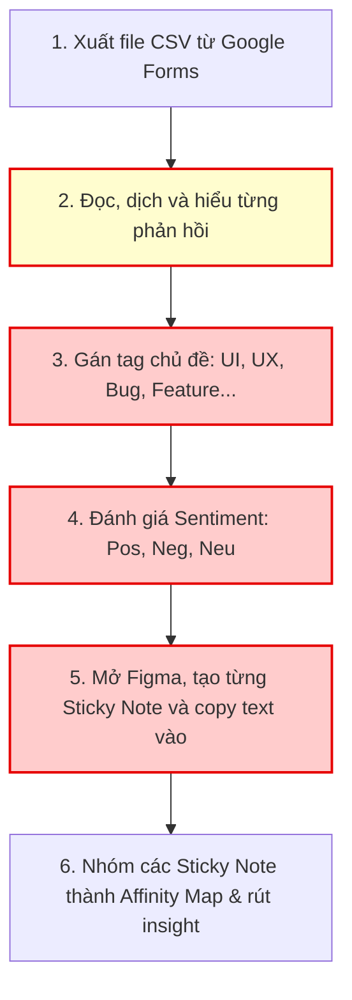
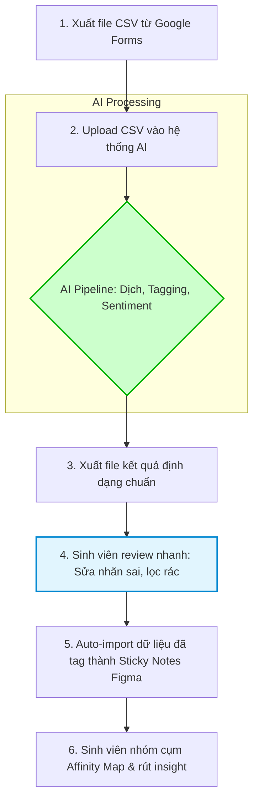

# Báo Cáo Nhóm

> **Môn học:** Day 02 Lab
> **Tên nhóm:** Nhóm 27
> **Thành viên & MSSV:**
> 1. **Nguyễn Nhựt Đăng**   - 2A202600602 (Nhóm trưởng)
> 2. **Hoàng Kim Tuấn Anh** - 2A202600574
> 3. **Nguyễn Thanh Toàn**  - 2A202600633
> 4. **Nguyễn Hưng Nguyên** - 2A202600652

# Phase 3 — Group Convergence: Từ 12 Candidates Về 1

## Bước 3.1 — Trình bày top 3 của các thành viên

| # | Người đề xuất | Candidate Problem | Người gặp vấn đề (Actor) | Điểm nghẽn chính (Bottleneck) | Tác động / Dấu hiệu thật |
|---|---|---|---|---|---|
| 1 | **Hoàng Kim Tuấn Anh** | Đánh giá khả năng phòng thủ của hệ thống RAG chatbot tuyển sinh VinUni | Nhóm phát triển chatbot tuyển sinh VinUni | Tạo các câu hỏi bẫy, edge cases, prompt injection thủ công rất tốn thời gian và độ phủ kém. | Rủi ro chatbot ảo tưởng thông tin hoặc bị jailbreak khi ra mắt thực tế trước hội đồng. |
| 2 | **Hoàng Kim Tuấn Anh** | Sinh viên non-tech gặp khó khăn cài đặt môi trường code dù có TAs | Sinh viên không chuyên CNTT & TAs | Chatbot/TA không hiểu cấu trúc phần cứng máy tính cụ thể của từng học viên để hướng dẫn. | Gây trễ tiến độ làm lab cá nhân, quá tải cho đội ngũ TAs hỗ trợ. |
| 3 | **Hoàng Kim Tuấn Anh** | Giảng viên và TAs bị quá tải bởi số lượng lớn câu trả lời trên Discord | Giảng viên, TAs | Đánh giá tính "sáng tạo", "độc đáo" của hàng trăm câu trả lời mà không chỉ dựa vào keywords. | Tốn nhiều giờ chấm thủ công sau mỗi buổi học trực tuyến. |
| 4 | **Nguyễn Thanh Toàn** | Phân tích phản hồi người dùng (User Feedback Analysis) | Product Manager, Customer Support | Phân loại ngữ cảnh, sắc thái phản hồi thủ công từ các kênh mạng xã hội, app store. | Mất 5-6 tiếng/tuần để đọc và gán nhãn, khó nhận diện phản hồi châm biếm. |
| 5 | **Nguyễn Thanh Toàn** | Chuyển PRD thô thành User Stories & Acceptance Criteria | Business Analyst (BA) | Viết tài liệu kỹ thuật rập khuôn (Gherkin format) thủ công từ PRD dài. | Mất 2-3 tiếng/bản PRD; rủi ro AI tự bịa ra logic nghiệp vụ mới. |
| 6 | **Nguyễn Thanh Toàn** | Tự động draft báo cáo tiến độ tuần (Weekly Project Log/Recap) | Nhóm trưởng (Team Lead) | Thu thập và tổng hợp dữ liệu thô tẻ nhạt từ Discord/Git/Figma về một mối. | Mất 1.5 - 2 tiếng mỗi tối Chủ Nhật; rủi ro bảo mật dữ liệu. |
| 7 | **Nguyễn Nhựt Đăng** | Tối ưu hóa tồn kho & Đề xuất lượng nhập hàng tích hợp Khuyến Mãi | Chủ cửa hàng bán lẻ (Đăng) | Kết nối lịch khuyến mãi POS với dữ liệu tồn kho để tăng/giảm lượng nhập động. | Ảnh hưởng trực tiếp đến dòng tiền, tỷ lệ hủy hàng cận date và doanh số. |
| 8 | **Nguyễn Nhựt Đăng** | Lập lịch ca làm việc & Tự động xử lý sự cố nhân viên xin nghỉ ca đột xuất | Quản lý cửa hàng (Store Manager) | Cân đối giờ làm, kỹ năng, OT lương khi sắp xếp người thay thế đột xuất. | Quy trình xử lý thủ công mất 30-45 phút mỗi lần có ca sự cố đột xuất. |
| 9 | **Nguyễn Nhựt Đăng** | Trích xuất báo giá sỉ & chiết khấu đại lý từ ảnh/PDF phi cấu trúc | Bộ phận mua hàng (Purchasing) | Đối chiếu thủ công các file ảnh/PDF báo giá sỉ lộn xộn để tìm nhà cung cấp rẻ nhất. | Mất hàng giờ lội chat Zalo và nhập liệu Excel, rủi ro sai sót số liệu cao. |
| 10| **Nguyễn Hưng Nguyên**| Đọc hiểu code cũ (Legacy Code) thiếu comment | Intern Software Engineer | Dò dẫm luồng code thủ công tốn thời gian, dễ hiểu sai business logic của dự án. | Làm chậm tiến độ hoàn thành task của intern; gây tải cho senior hướng dẫn. |
| 11| **Nguyễn Hưng Nguyên**| Fix lỗi từ thông báo Stack Trace trên Terminal | Intern Software Engineer | Phải chuyển đổi ngữ cảnh liên tục sang StackOverflow để lọc thông tin rác và fix mò. | Mất 15-20 phút cho mỗi lỗi nhỏ; giảm sự tập trung khi code. |
| 12| **Nguyễn Hưng Nguyên**| Pull Request bị từ chối do lỗi lặt vặt (Convention) | Intern & Senior Developer | Quá trình feedback ping-pong lặp đi lặp lại chỉ vì lỗi convention/style guide. | Senior tốn thời gian review vụn vặt; PR bị ngâm lâu trên Git. |

---

## Bước 3.2 — Gom trùng / cluster

| Cluster | Candidates included | Pattern chung | Ghi chú |
|---|---|---|---|
| **A. IT & Dev Support** | 2, 10, 11, 12 | Hỗ trợ Junior/Intern vượt qua các khó khăn kỹ thuật rập khuôn (setup, review, fix bug, hiểu code) để giảm tải cho Mentor/Senior. | Bài toán phổ biến nhưng đang dần bị giải quyết bởi các công cụ như GitHub Copilot / Cursor. |
| **B. Retail Operations** | 7, 8, 9 | Tự động hoá luồng xử lý thông tin phi cấu trúc trong vận hành bán lẻ (so sánh giá sỉ, xếp ca, quản lý tồn kho). | Đau đớn rất cụ thể về tiền bạc và thời gian của cấp quản lý, chủ doanh nghiệp. |
| **C. Content & Doc Gen** | 4, 5, 6 | Đọc dữ liệu văn bản thô (Feedback, PRD, Log) và chuyển hóa thành tài liệu cấu trúc (Nhãn dán, User Story, Báo cáo). | Tiết kiệm nhiều giờ lặp đi lặp lại hàng tuần cho BA, PM. |
| **D. EdTech / QA** | 1, 3 | Tự động chấm điểm (hàng trăm tin nhắn) hoặc tự động test hệ thống (sinh prompt) thay vì con người làm thủ công. | |

---

## Bước 3.3 — Shortlist

| Candidate | Vì sao vào shortlist | Rủi ro / điều chưa rõ |
|---|---|---|
| **#4 (Toàn)**: Phân tích phản hồi người dùng (User Feedback Analysis) | Vấn đề tiêu tốn nhiều thời gian của Product Manager/CS. Dữ liệu (feedback) là text thô, rất phù hợp với thế mạnh NLP của LLM. Tác động rõ ràng: giảm 5-6 tiếng/tuần, tăng tốc độ phản hồi KH. | Khó nhận diện chính xác các câu nói mỉa mai (sarcasm) hoặc tiếng lóng (slang), AI có thể gán nhãn sai làm lệch báo cáo. |
| **#5 (Toàn)**: Chuyển PRD thô thành User Stories & Acceptance Criteria | Dễ dàng thu thập data mẫu, có tiêu chuẩn đầu ra rõ ràng (Gherkin format). Giải phóng sức lao động "chép tay" cho các BAs, dễ demo trong lab. | AI có thể bị "ảo giác" (hallucinate) và tự chế ra logic nghiệp vụ không hề có trong PRD nếu context không đủ sâu. |
| **#10 (Nguyên)**: Đọc hiểu code cũ (Legacy Code) thiếu comment | Context window siêu lớn của LLM hiện tại hoàn toàn phù hợp để nuốt trọn nhiều file code và tóm tắt luồng. Ai làm Dev cũng thấm thía nỗi đau này. | Code chứa các business logic ngầm ẩn phức tạp, AI có thể chỉ dịch syntax chay sang tiếng Việt thay vì giải thích được nghiệp vụ. |

---

## Bước 3.4 — Score để đồng thuận

*Chấm 1-5 điểm cho mỗi tiêu chí*

| Candidate | Actor rõ | Workflow rõ | Pain có evidence | Impact đo được | Làm trong lab | So sánh R/W/A được | Nhóm hiểu domain | **Tổng** |
|---|---:|---:|---:|---:|---:|---:|---:|---:|
| **#4 (User Feedback)** | 5 | 5 | 5 | 5 | 5 | 5 | 4 | **34** |
| **#5 (PRD -> User Stories)** | 5 | 5 | 4 | 5 | 5 | 4 | 4 | **32** |
| **#10 (Legacy Code)** | 5 | 4 | 5 | 4 | 5 | 3 | 4 | **30** |

---

### Kết Quả Đồng Thuận Chọn 1 Problem Duy Nhất:

**Candidate nhóm chọn:**
> **Candidate #4 (Nguyễn Thanh Toàn):** Phân tích phản hồi người dùng (User Feedback Analysis) từ các kênh mạng xã hội, app store cho Product Manager.

**Vì sao chọn:**
1. **Tính thực tiễn cao:** Phân loại hàng ngàn feedback thủ công là nỗi ám ảnh của mọi team Product/CS. Việc gán nhãn (tagging) bằng cơm rất tốn thời gian và dễ sai sót do cảm tính.
2. **Impact đong đếm được:** Tiết kiệm 5-6 tiếng làm việc mỗi tuần; giúp đội ngũ ra quyết định product nhanh hơn dựa trên dữ liệu thật.
3. **So sánh R/W/A sắc nét:** 
   - *Rule/Software:* Dùng regex lọc từ khóa (chữ "tệ", "lỗi") nhưng dễ bắt nhầm từ (VD: "Không tệ", "Quá tệ").
   - *Workflow:* Cứ mỗi cuối ngày, AI gom file Excel chứa feedback lại, phân tích sắc thái (Sentiment) và tự động gán nhãn lỗi (Bug, Feature Request) rồi gửi báo cáo qua mail.
   - *Agent:* Agent liên tục crawl app store/social media theo thời gian thực; nếu phát hiện luồng feedback tiêu cực tăng đột biến do lỗi hệ thống, tự động ping cảnh báo cấp thiết lên kênh Slack của Dev.

**Vì sao không chọn các candidate còn lại:**
- Các bài toán về **Dev/IT** (Hiểu code cũ, fix bug) hiện tại đã được giải quyết quá mạnh mẽ bởi các AI-Native IDE (như Cursor, GitHub Copilot).
- Bài **PRD to User Stories** cũng rất tốt, nhưng về độ phong phú của dữ liệu (cảm xúc người dùng, tiếng lóng) và tiềm năng phát triển thành một hệ thống cảnh báo (Agent) thì bài Feedback Analysis hấp dẫn hơn để làm Lab. Hơn nữa, xử lý Text bằng LLM (bài #4) dễ demo thành công hơn xử lý Ảnh/PDF (bài #9) trong khuôn khổ 4 tiếng của Lab.

**Nếu có disagreement, nhóm xử lý thế nào:**
- Nhóm dùng hệ thống chấm điểm khách quan. Điểm số của bài #4 cao nhất do tính khả thi cực tốt trong việc làm Lab (Xử lý Text bằng LLM là thế mạnh tuyệt đối).
- Thành viên Toàn đã có sẵn một tập dataset (file Excel/CSV) chứa hàng trăm review app thật của khách hàng, đảm bảo nhóm có "data xịn" để test ngay lập tức.

---
 

# Phase 4 — Quick Validation + Research giải pháp (30')

## Mục tiêu
Sau khi chọn Candidate Problem: **Phân tích phản hồi của người dùng (User Feedback Analysis)**, nhóm tiến hành kiểm tra nhanh xem nỗi đau này có thật không và thị trường đã giải quyết đến đâu.

---

## Bước 4.1 — Quick validation

Nhóm đã sử dụng phương pháp **Option A (Quick interviews)** kết hợp hỏi nhanh trên group chat sinh viên.

**Kết quả:**

| Nguồn | Số người / số mẫu | Tín hiệu xác nhận | Tín hiệu phản bác | Nhóm sửa problem thế nào |
|---|---:|---|---|---|
| **Interview** | 3 (Sinh viên UX/BA) | 100% xác nhận khâu mệt nhất là đọc, dịch và copy-paste từng dòng feedback từ Excel sang Sticky Notes trên Figma. | 1 bạn cho rằng nếu form khảo sát chỉ có < 30 câu trả lời thì thà tự đọc bằng mắt còn nhanh hơn setup tool AI. | Giới hạn scope của Problem: "Chỉ áp dụng cho các khảo sát/testing có **số lượng phản hồi lớn (từ 50 - 100+ mẫu)**". |
| **Survey / poll** | 12 (Group Discord) | 9/12 bạn (75%) chấm điểm mức độ "Đau đớn" ở mức 4-5 sao khi phải gán nhãn thủ công cho tập dữ liệu thô. | Một số bạn dùng Excel Filter lọc từ khóa để làm cho nhanh. | Bổ sung thêm tính năng AI phải hiểu được ngữ nghĩa ngầm (slang, sarcasm) thay vì chỉ bắt keyword như Excel. |

---

## Bước 4.2 — Research giải pháp đã có

Nhóm đã tìm kiếm các công cụ chuyên dụng cho User Research & Feedback Analysis trên thị trường:

| Nguồn / tool / case | Link | Họ giải quyết phần nào? | Điểm mạnh | Khoảng trống / rủi ro | Bài học cho nhóm |
|---|---|---|---|---|---|
| **Dovetail** | [dovetail.com](https://dovetail.com) | Lưu trữ research, gán tag, tự động dịch & highlight insight từ video/text. | Tính năng cực kỳ mạnh mẽ, dành riêng cho Researcher chuyên nghiệp. | **Rào cản:** Trả phí quá đắt so với sinh viên ($30/tháng). Quá cồng kềnh nếu chỉ cần phân tích 1 file CSV nhỏ. | Giải pháp của nhóm cần **nhỏ gọn, miễn phí/giá rẻ**, tập trung đúng một luồng: Nhận CSV $\rightarrow$ Bơm ra Figma. |
| **MonkeyLearn (by Medallia)** | [monkeylearn.com](https://monkeylearn.com) | Nền tảng No-code chuyên phân tích văn bản và sắc thái cảm xúc (Sentiment Analysis). | Phân loại cảm xúc (Tích cực/Tiêu cực) cực nhanh và trực quan nhờ các pre-trained models có sẵn. | **Rào cản:** Đã bị Medallia mua lại và ngừng cho phép đăng ký tài khoản mới (từ 8/2023). Bản thương mại trước đây có giá cực kỳ đắt ($299/tháng), không khả thi cho sinh viên. | Workflow AI của nhóm không chỉ dừng ở việc "trả ra bảng Excel" mà phải **xuất được định dạng để import thẳng thành Sticky Note** trên Figma/Miro. |
| **Figma AI (Jambot)** | [figma.com/figjam/ai](https://www.figma.com/figjam/ai/) | Gom cụm các sticky notes đã có sẵn trên bàn vẽ FigJam lại theo chủ đề. | Tích hợp sẵn trong hệ sinh thái Figma, rất tiện. | **Khoảng trống:** Nó chỉ giúp gom nhóm *sau khi* bạn đã tốn 80 phút copy-paste từng câu vào Sticky Note. Chưa giải quyết bước đọc, dịch và gán tag từ file Excel thô ban đầu. | Giải pháp của nhóm sẽ bù đắp khâu "Tiền kỳ" trước khi lên bàn vẽ Figma. |

---

### Kết luận từ Phase 4:
- Nỗi đau của Actor (Student UX/BA) là **có thật và xảy ra thường xuyên** mỗi khi làm đồ án.
- Các tool xịn (Dovetail) thì quá đắt và cồng kềnh, các tool tích hợp sẵn (FigJam AI) thì chưa giải quyết đúng điểm nghẽn (khâu đọc file thô & copy-paste).
- **Quyết định:** Bài toán hoàn toàn khả thi và đáng giá để thiết kế một AI Workflow giải quyết nhanh gọn lẹ. Nhóm tự tin bước vào Phase 5.

---
 

# Phase 5 — Workflow + Problem Statement (45')

## Bước 5.1 — Current workflow bản nhóm

**Bối cảnh:** Sinh viên UX/BA thu thập được hơn 100 phản hồi thô từ người dùng.

| Bước | Actor | Input | Output | Thời gian/tần suất | Ghi chú |
|---|---|---|---|---|---|
| 1. Xuất CSV | Sinh viên | Google Forms | File CSV thô | 5 phút | Rất nhanh, hệ thống hỗ trợ sẵn |
| 2. Đọc & dịch | Sinh viên | Dòng text CSV | Hiểu ngữ cảnh | 30 phút | Đọc 100+ dòng rất nản và mỏi mắt |
| 3. Gán tag | Sinh viên | Text đã hiểu | Lọc theo category | 30 phút | Dễ bị bias (định kiến) cá nhân |
| 4. Đo Sentiment| Sinh viên | Category tag | Nhãn Pos/Neg/Neu | 15 phút | Dễ nhầm câu mỉa mai thành tích cực |
| 5. Paste Figma | Sinh viên | Dữ liệu hoàn chỉnh | Hàng chục Sticky Notes| 30 phút | Thao tác copy-paste lặp đi lặp lại |
| 6. Rút Insight | Sinh viên | Sticky Notes rời rạc| Affinity Map Insight | 20 phút | Bước dùng chất xám thực sự |

**Bottleneck chính:**
Khâu xử lý văn bản thô (Bước 2, 3, 4) và Thao tác copy-paste thủ công lên Figma (Bước 5) chiếm tới 75% tổng thời gian (105 phút/130 phút), làm sinh viên cạn kiệt năng lượng trước khi bước vào khâu quan trọng nhất là Rút Insight (Bước 6).

---

## Bước 5.2 — Future workflow bản nhóm

**Giải pháp:** Xây dựng một AI Workflow giúp đọc, dịch, phân loại dữ liệu và xuất ra định dạng sẵn sàng nạp thẳng vào Figma.

**Chi tiết Workflow mới:**
- **AI xử lý:** Khâu đọc, dịch, phân loại chủ đề và đo lường cảm xúc (Bước 2 trong workflow cũ).
- **Con người làm:** Review lại kết quả AI (Bước 4) và trực tiếp vẽ map, rút Insight cuối cùng (Bước 6).
- **Ranh giới (Boundary):** Con người BẮT BUỘC phải rà soát lại kết quả phân loại của AI xem có hợp lý với định hướng bài tập không trước khi đẩy lên Figma. AI không được quyền tự vẽ hay tự đưa ra Insight thiết kế cuối cùng.
- **Fallback (Nếu AI sai):** Nếu AI gán nhãn sai quá nhiều do câu trả lời chứa tiếng lóng khó hiểu, sinh viên sẽ quay về dùng Filter của Excel để tự chia cụm.

**Before/after impact:**

| Metric | Trước | Sau kỳ vọng | Ghi chú |
|---|---:|---:|---|
| **Số bước** | 6 bước | 6 bước | Số bước không đổi, nhưng giảm gánh nặng thao tác tay |
| **Tổng thời gian** | ~130 phút | ~45 phút | Tiết kiệm ~65% thời gian |
| **Số bước thủ công** | 5 bước | 2 bước | Chỉ còn giữ lại bước Review và Rút Insight |
| **Bottleneck chính** | Đọc, dịch, copy-paste | Review lại kết quả của AI | Phụ thuộc vào độ chính xác của prompt |
| **Risk mới** | Không có | Quá tin tưởng AI, bỏ sót insight | Cần thiết lập nguyên tắc human-in-the-loop chặt chẽ |

---

## Bước 5.3 — Problem Statement v0

| Field | Nội dung |
|---|---|
| **Actor** | Sinh viên Product Design / BA trong quá trình làm đồ án UX Research. |
| **Workflow** | Thu thập feedback $\rightarrow$ Đọc & Dịch $\rightarrow$ Gán tag chủ đề $\rightarrow$ Phân tích Sentiment $\rightarrow$ Import lên Figma $\rightarrow$ Vẽ Affinity Map. |
| **Bottleneck** | Khâu xử lý văn bản thô (đọc, dịch, gán nhãn) và khâu "cửu vạn" (copy-paste lên sticky notes) chiếm tới 75% thời gian, rất dễ sai sót cảm tính và làm nản lòng. |
| **Impact** | Sinh viên mất quá nhiều thời gian vào việc thao tác chân tay, không còn đủ năng lượng và thời gian cho việc phân tích insight thiết kế chuyên sâu. Gây trễ tiến độ nộp bài. |
| **Success Metric** | Giảm tổng thời gian xử lý 100 feedback từ 130 phút xuống dưới 45 phút; Độ chính xác của AI tagging đạt >90% (theo đánh giá của sinh viên sau khi review). |
| **Boundary** | AI chỉ làm nhiệm vụ dọn dẹp và phân loại dữ liệu thô (Clerk). Con người (Designer) đóng vai trò quyết định (Judge) rà soát lại nhãn và trực tiếp vẽ Insight trên Figma. |

---
 

# Phase 6 — Rule / Workflow / Agent + Decision (25')

## Bước 6.0 — Ma trận độ phù hợp với AI để suy nghĩ nhanh

**Bài toán của nhóm nằm ở ô nào?**
Nằm ở ô: **Độ mơ hồ cao + Độ phức tạp thấp**.

**Vì sao?**
- **Độ mơ hồ cao:** Việc đọc hiểu feedback chứa rất nhiều cảm xúc người dùng, tiếng lóng, từ viết tắt, hoặc câu mỉa mai ("App xịn quá, load 5 phút chưa xong"). Việc gán nhãn không có ranh giới đúng/sai tuyệt đối (chữ "xịn" là tích cực nhưng ngữ cảnh là tiêu cực). Do đó, Rule (Regex) sẽ thất bại.
- **Độ phức tạp thấp:** Luồng đi rất tuyến tính và ngắn gọn: `Input CSV` $\rightarrow$ `Xử lý Text` $\rightarrow$ `Output File` $\rightarrow$ `Figma`. Không cần AI tự rẽ nhánh hay tự lên kế hoạch phức tạp.

$\Rightarrow$ **Kết luận:** Dùng Workflow có AI hỗ trợ một bước (Khâu xử lý Text) là cực kỳ phù hợp.

---

## Bước 6.1 — So sánh Rule / Workflow / Agent

| Mức | Phương án cho bài toán nhóm | Khi nào đủ | Rủi ro | Chọn? |
|---|---|---|---|---|
| **Rule** | Dùng Regex hoặc Excel Filter lọc các từ khóa như "lỗi", "chậm", "tệ" để đếm số lượng. | Khi feedback chỉ là câu hỏi trắc nghiệm hoặc có cấu trúc rất cứng nhắc. | Bỏ sót rất nhiều ý nghĩa ngầm; không phân loại được cảm xúc phức tạp. | Không |
| **Workflow** | Sinh viên nạp file CSV $\rightarrow$ AI tự động dịch, gán Tag & chấm điểm Sentiment $\rightarrow$ Sinh viên Review $\rightarrow$ Đẩy sang Figma. | Luôn đủ để giải quyết điểm nghẽn lớn nhất là khâu đọc hiểu và phân loại thủ công. | Sinh viên quá tin tưởng AI, không review kỹ dẫn đến sai lệch Insight. | **Chọn** |
| **Agent** | Agent tự động rà quét kho Data mỗi ngày, tự gom feedback, tự vẽ Affinity Map, tự đề xuất tính năng mới. | Khi cần một hệ thống quản trị Product lớn và liên tục (Dành cho Product Manager full-time). | Quá over-engineering cho một bài tập đồ án của sinh viên. Đánh mất "Human touch" của người Designer. | Không |

**Mức chọn:**
`Workflow`

**Vì sao chọn:**
Workflow giải quyết trúng phóc cái rốn của nỗi đau (Khâu xử lý text) mà vẫn giữ được ranh giới an toàn (Human in the loop - Sinh viên tự chốt Insight). Nó dễ triển khai làm POC trong lab hơn là làm Agent.

**Vì sao không chọn mức đơn giản hơn (Rule):**
Vì dữ liệu là ngôn ngữ tự nhiên (NLP) rất đa dạng và phức tạp, Rule không thể nào cover hết được các case mỉa mai hay cách diễn đạt mới của người dùng.

---

## Bước 6.2 — Problem Statement v1

| Field | Nội dung |
|---|---|
| **Actor** | Sinh viên Product Design / BA trong quá trình làm đồ án UX Research. |
| **Workflow** | Thu thập feedback $\rightarrow$ Đọc & Dịch $\rightarrow$ Gán tag chủ đề $\rightarrow$ Phân tích Sentiment $\rightarrow$ Import lên Figma $\rightarrow$ Vẽ Affinity Map. |
| **Bottleneck** | Khâu xử lý văn bản thô (đọc, dịch, gán nhãn) và khâu "cửu vạn" (copy-paste lên sticky notes) chiếm tới 75% thời gian, rất dễ sai sót cảm tính và làm nản lòng. |
| **Impact** | Sinh viên mất quá nhiều thời gian vào việc thao tác chân tay, không còn đủ năng lượng và thời gian cho việc phân tích insight thiết kế chuyên sâu. Gây trễ tiến độ nộp bài. |
| **Success Metric** | Giảm tổng thời gian xử lý 100 feedback từ 130 phút xuống dưới 45 phút; Độ chính xác của AI tagging đạt >90% (theo đánh giá của sinh viên sau khi review). |
| **Boundary** | AI chỉ làm nhiệm vụ dọn dẹp và phân loại dữ liệu thô (Clerk). Con người (Designer) đóng vai trò quyết định (Judge) rà soát lại nhãn và trực tiếp vẽ Insight trên Figma. |
| **AI intervention point**| Can thiệp mạnh vào Bước 2, 3, 4 (Đọc dịch, Gán nhãn, Sentiment). |
| **Mức chọn** | **Workflow** |
| **Rủi ro & người thật kiểm tra** | Rủi ro AI hiểu sai tiếng lóng/slang. Sinh viên BẮT BUỘC rà soát nhanh bảng dữ liệu kết quả trước khi nhấn nút "Push to Figma". |

---

## Bước 6.3 — Final decision

| Câu hỏi | Yes / Not Yet / No | Ghi chú |
|---|---|---|
| Actor và workflow đã rõ chưa? | **Yes** | Rõ ràng từng bước từ Form ra Figma |
| Baseline và success metric đã đo được chưa? | **Yes** | Từ 130 phút $\rightarrow$ 45 phút |
| Có data/input đủ dùng chưa? | **Yes** | Có sẵn file CSV hàng trăm feedback từ dự án cũ |
| Nếu AI sai, hậu quả có chấp nhận được không? | **Yes** | Chấp nhận được vì Sinh viên có khâu Review làm lưới lọc |
| Có người review/owner vận hành không? | **Yes** | Sinh viên UX chính là owner |
| Có cách non-AI đơn giản hơn không? | **No** | Excel filter đã được chứng minh là quá thô sơ |

**Decision:**
`Go`

**Lý do:**
Bài toán đã hội tụ đầy đủ các yếu tố của một AI Product lý tưởng: Nỗi đau rõ ràng, thời gian có thể đo lường, dữ liệu Text thô (đúng thế mạnh của LLM), và khả năng làm POC (Proof of Concept) thành công rất cao trong thời gian ngắn.

**Nếu Go, pilot nhỏ nhất là:**
Tạo một file Google Sheets tích hợp Gemini/OpenAI API (bằng App Script). Khi dán 50 dòng feedback thô vào cột A, bấm nút $\rightarrow$ Cột B, C, D tự động điền bản dịch, Tag, Sentiment. Chưa cần làm tính năng tự bắn API sang Figma ngay (sinh viên có thể import CSV thủ công vào FigJam tạm thời).